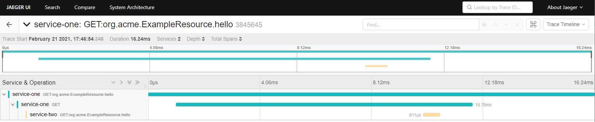

# how to startup jaeger-tracing

this is the [guide](https://quarkus.io/guides/opentracing#quarkus-jaeger_quarkus.jaeger.sampler-param)

```docker run -p 5775:5775/udp -p 6831:6831/udp -p 6832:6832/udp -p 5778:5778 -p 16686:16686 -p 14268:14268 jaegertracing/all-in-one:latest```

then the service will be available at http://localhost:16686/search

this is what you'll see 




# how to send the logs to kibana

this is the [guide](https://quarkus.io/guides/centralized-log-management)

todo... 
